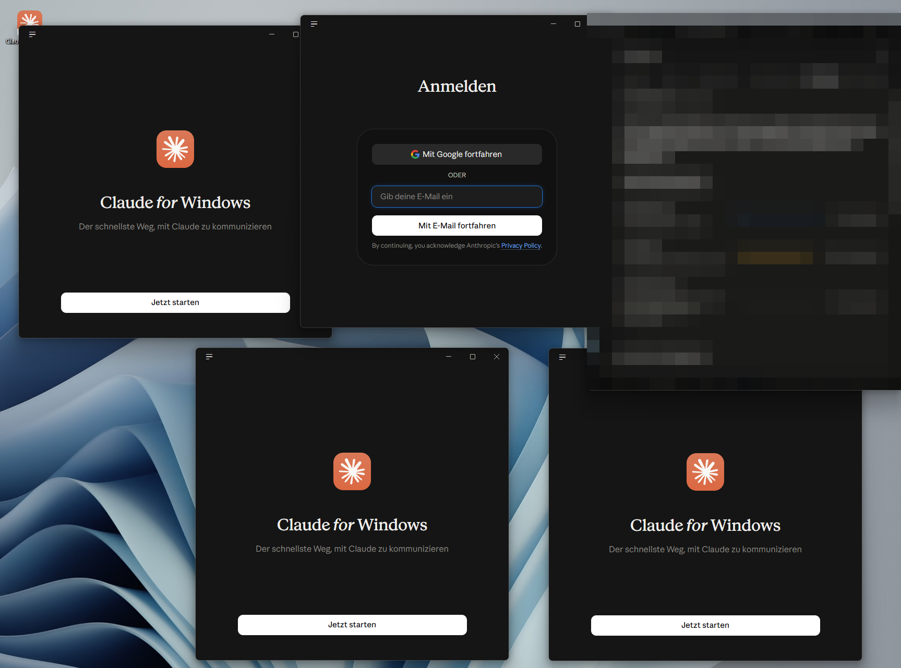
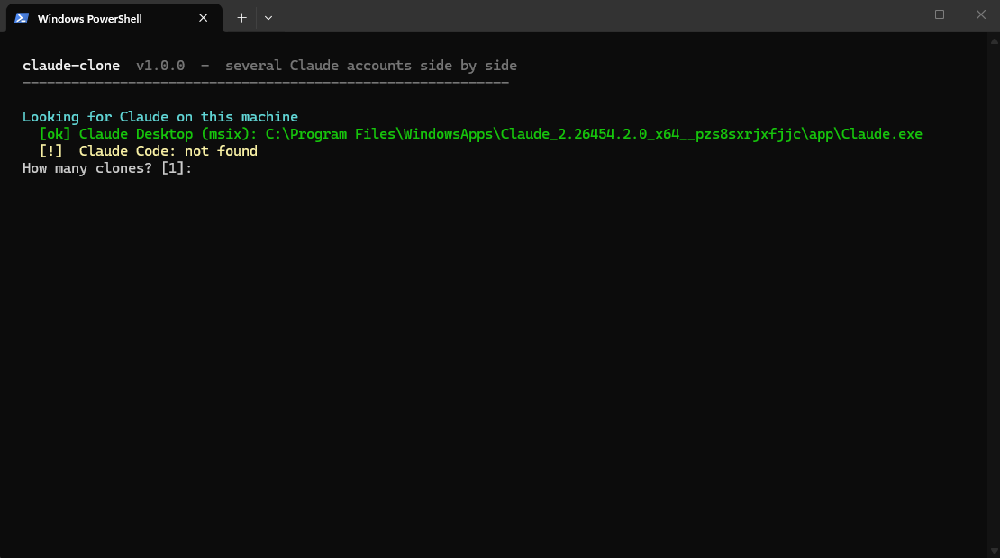
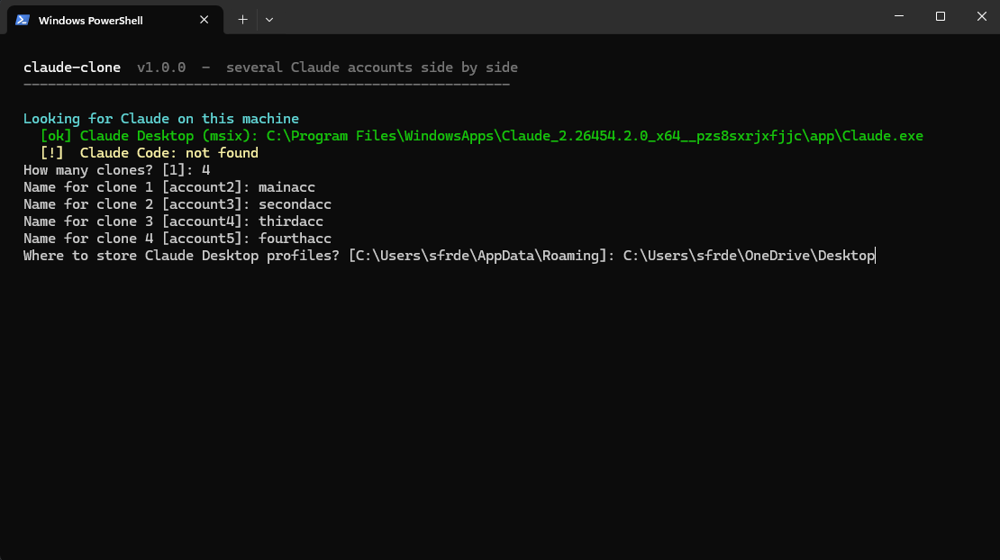
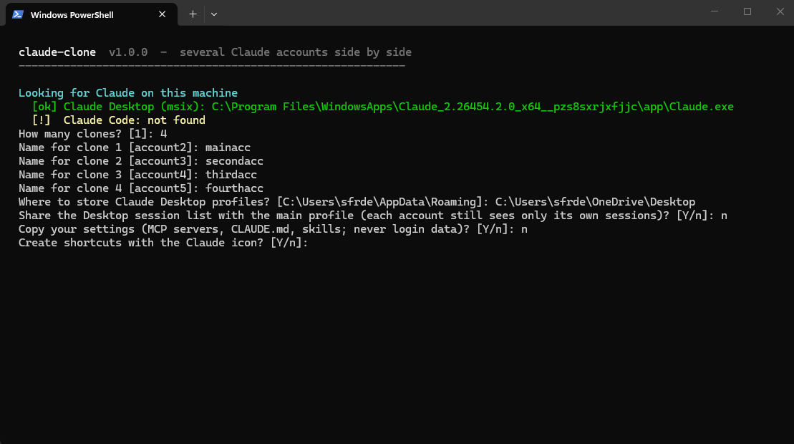

<div align="center">

# claude-clone

**Run several Claude accounts side by side - Claude Desktop and Claude Code, each in its own profile.**

One script. It finds Claude on your machine, asks a few questions and gives every account its own
launcher with the Claude icon. Your main installation is never touched.

[](LICENSE)




<sub>Four independent Claude Desktop profiles on one Windows machine, each waiting for its own sign-in.</sub>

[Quick start](#quick-start) &nbsp;·&nbsp; [Screenshots](#screenshots) &nbsp;·&nbsp; [What you get](#what-you-get) &nbsp;·&nbsp; [Options](#options) &nbsp;·&nbsp; [How it works](#how-it-works) &nbsp;·&nbsp; [FAQ](#faq)

</div>

---

## Why

Claude Desktop keeps exactly one signed-in account per installation. If you use Claude for work and
privately, or for two clients, you end up signing out and in all day. **claude-clone** gives every
account its own profile, so they run at the same time - each window, each terminal, each with its own
login.

## Features

| | |
|---|---|
| **Auto-detection** | Finds Claude Desktop (Microsoft Store / MSIX, classic installer, macOS app, Linux builds) and Claude Code (native installer, npm, the copy bundled with Claude Desktop). |
| **Interactive or scripted** | Asks how many clones, their names and where to store them - or pass everything as flags. |
| **Real shortcuts** | Desktop and Start-menu shortcuts with the Claude icon (Windows), app bundles (macOS), `.desktop` entries (Linux). A "main" shortcut for your current account, too. |
| **Update-proof** | Launchers resolve the Claude executable at start, so they keep working after Claude updates itself. |
| **Your sessions follow** | Optionally shares the Desktop session list, so each account sees its own (archived) Claude Code sessions in every profile. |
| **Settings carried over** | Copies MCP servers, extensions, `CLAUDE.md`, settings, skills, agents and commands. **Never** login data. |
| **Clean removal** | `-Remove` / `--remove` deletes shortcuts and launchers; `-Purge` / `--purge` also deletes the profile - without following links into your main profile. |

## Quick start

### Windows (PowerShell)

```powershell
powershell -ExecutionPolicy Bypass -c "& ([scriptblock]::Create((irm https://raw.githubusercontent.com/sfr-development/claude-clone/main/claude-clone.ps1)))"
```

### macOS / Linux

```bash
bash <(curl -fsSL https://raw.githubusercontent.com/sfr-development/claude-clone/main/claude-clone.sh)
```

<details>
<summary>Prefer to read the script first? (recommended)</summary>

```bash
git clone https://github.com/sfr-development/claude-clone.git
cd claude-clone
./claude-clone.sh            # macOS / Linux
.\claude-clone.ps1           # Windows
```

</details>

Then open the new **Claude (account2)** shortcut and sign in with the second account. That's it.

## Screenshots

<table>
  <tr>
    <td width="33%"></td>
    <td width="33%"></td>
    <td width="33%"></td>
  </tr>
  <tr>
    <td align="center"><sub><b>1.</b> Finds every Claude installation</sub></td>
    <td align="center"><sub><b>2.</b> How many clones, which names, where</sub></td>
    <td align="center"><sub><b>3.</b> Sessions, settings, shortcuts</sub></td>
  </tr>
</table>

```text
  claude-clone  v1.2.0  -  several Claude accounts side by side
  ------------------------------------------------------------

  Looking for Claude on this machine
    [ok] Claude Desktop (msix): C:\Program Files\WindowsApps\Claude_...\app\Claude.exe
    [ok] Claude Code: C:\Users\you\.local\bin\claude.exe

  What do you want to clone?
    1) Claude Desktop      2) Claude Code (CLI)      3) both
  Choose 1, 2 or 3 [1] 3
  How many clones? [1] 2
  Name for clone 1 [account2] work
  Name for clone 2 [account3] client-a
  ...
```

## Dashboard

Run the PowerShell script without options and it opens a small dashboard right in the terminal (macOS/Linux: `--list` shows the same status table): what is installed,
every clone with its status (running, signed in, not signed in, missing folder) and when it was last used -
plus profiles that something else started with `--user-data-dir`. Navigate with the arrow keys or press
a number.

```text
  ╭────────────────────────────────────────────────────────────────────────────╮
  │ claude-clone v1.2.0                   several Claude accounts side by side │
  ╰────────────────────────────────────────────────────────────────────────────╯

  INSTALLED
    ● Claude Desktop  Microsoft Store   2.26454.2.0
    ● Claude Code     2.1.293  (bundled with Claude Desktop)

  YOUR CLONES (3)
      NAME          APP      STATUS         LAST USED  FOLDER
    ● work          Desktop  running        just now   ~\.claude-clone\profiles\Claude-work
    ● client-a      Desktop  signed in      2 h ago    ~\.claude-clone\profiles\Claude-client-a
    ○ personal      Code     not signed in  -          ~\.claude-personal

  What would you like to do?
   › Launch a clone
     Create new clones
     Remove a clone
     Repair shortcuts
     Open a profile folder
     Quit
```

On Windows, clones you created by hand or with an older version are found automatically and added to the list.
Status checks only look at *whether* a login exists - never at its contents.

## What you get

For a clone named `work`:

| | Windows | macOS | Linux |
|---|---|---|---|
| **Desktop profile** | `%USERPROFILE%\.claude-clone\profiles\Claude-work` | `~/Library/Application Support/Claude-work` | `~/.config/Claude-work` |
| **Desktop launcher** | `Claude (work)` on the Desktop and in the Start menu | `~/Applications/Claude (work).app` + Desktop alias | `claude-desktop-work`, app-menu entry, Desktop entry |
| **Claude Code profile** | `%USERPROFILE%\.claude-work` | `~/.claude-work` | `~/.claude-work` |
| **Claude Code command** | `claude-work` | `claude-work` | `claude-work` |
| **Code shortcut** | `Claude Code (work)` (opens a terminal) | `Claude Code (work).command` | `.desktop` entry with terminal |

A list of all clones is kept in `~/.claude-clone/`.

## Options

| PowerShell | Bash | Meaning |
|---|---|---|
| `-Product desktop\|code\|both` | `--product ...` | What to clone |
| `-Count 2` | `--count 2` | Number of clones (names default to `account2`, `account3`, ...) |
| `-Names work,client-a` | `--names work,client-a` | Clone names |
| `-Path D:\Profiles` | `--path ~/profiles` | Where to store the profiles |
| `-NoShareSessions` | `--no-share-sessions` | Do not share the Desktop session list |
| `-NoCopySettings` | `--no-copy-settings` | Start every profile with default settings |
| `-NoShortcuts` | `--no-shortcuts` | No shortcuts / launcher entries |
| `-NoMainShortcut` | `--no-main-shortcut` | No extra shortcut for the main account |
| `-NoPath` | | Do not add the command folder to `PATH` (Windows) |
| `-Yes` | `--yes` | Accept all defaults, no questions |
| `-List` | `--list` | List clones with their status |
| `-Launch work` | `--launch work` | Start a clone |
| `-Repair` | | Re-create all shortcuts and icons (Windows) |
| `-Remove work` | `--remove work` | Remove shortcuts and launchers of a clone |
| `-Remove work -Purge` | `--remove work --purge` | ... and delete its profile (signs it out) |

Example, fully unattended:

```powershell
.\claude-clone.ps1 -Product both -Names work,client-a -Yes
```

## How it works

- **Claude Desktop** is an Electron app. Started with `--user-data-dir=<folder>`, it uses a completely
  separate profile - its own login, windows, cache and settings - and runs next to the main app.
- **Claude Code** reads its configuration from `CLAUDE_CONFIG_DIR`. Each clone gets its own folder and a
  small wrapper command that sets it.
- **Shared session list (optional).** Claude Desktop stores the list of Claude Code sessions per
  account (`claude-code-sessions/<account-id>/...`). Linking that folder into every profile means any
  account sees its own sessions - including archived ones - in whichever profile it signs into. No
  account can see another account's sessions.
- **Microsoft Store version.** The Store (MSIX) build of Claude Desktop keeps its data in a private,
  virtualized AppData folder (`%LOCALAPPDATA%\Packages\Claude_...\LocalCache\Roaming\Claude`). claude-clone
  detects this and links to the real location, and stores clone profiles outside AppData so they are
  not virtualized.
- **Shared runtime.** The Claude Code runtime that Claude Desktop downloads is linked, not copied, so
  clones start instantly and do not use extra disk space.

## FAQ

<details>
<summary><b>Does it change my main Claude installation?</b></summary>

No. It only creates new folders, launchers and shortcuts. The main profile is read (to copy settings)
and, if you allow it, linked into the clones - never modified.
</details>

<details>
<summary><b>Are passwords or tokens copied?</b></summary>

No. Login data (`.credentials.json`, the Desktop token cache) is never copied. Every clone asks you
to sign in once.
</details>

<details>
<summary><b>What happens when Claude updates?</b></summary>

Nothing breaks. Launchers look up the current Claude executable each time they start. Shortcut icons
are stored as a copy inside the clone's profile.
</details>

<details>
<summary><b>Signing in opens my browser and lands in the wrong window.</b></summary>

Sign-in links that return through the browser (for example "Continue with Google") are handed to the
app that is registered for the `claude://` link - usually the main app. Sign in with the email code
inside the clone window instead.
</details>

<details>
<summary><b>Can I keep the profiles in OneDrive / Dropbox?</b></summary>

Better not. A running app writes to its profile constantly (caches, databases, lock files); a sync
client fights over those files. claude-clone warns when you pick a synced folder. Keep profiles local -
the default (`~/.claude-clone/profiles` on Windows) is not synced.
</details>

<details>
<summary><b>How do I remove everything?</b></summary>

Run `-Remove <name> -Purge` (Windows) or `--remove <name> --purge` (macOS/Linux) for each clone, then
delete `~/.claude-clone`.
</details>

<details>
<summary><b>Is Claude Desktop available on Linux?</b></summary>

There is no official Linux build. claude-clone detects common community packages
(`claude-desktop`, AppImages) and always supports Claude Code.
</details>

## Requirements

- **Windows:** Windows 10 or 11, Windows PowerShell 5.1 or PowerShell 7.
- **macOS:** Bash (preinstalled), Claude Desktop in `/Applications` or `~/Applications`.
- **Linux:** Bash 3.2+, a desktop environment that reads `.desktop` files for shortcuts.

## Disclaimer

claude-clone is an independent, unofficial tool. It is not affiliated with, endorsed or supported by
Anthropic. "Claude" is a trademark of Anthropic; the icon used for shortcuts is taken from your own
local Claude installation and is not distributed with this project. Use each account in line with
Anthropic's terms of service.

## License

[MIT](LICENSE)
